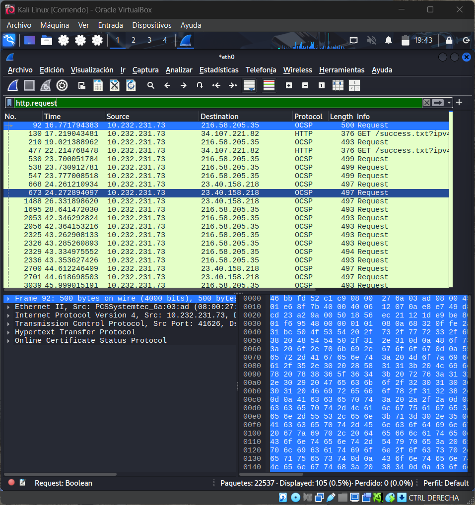
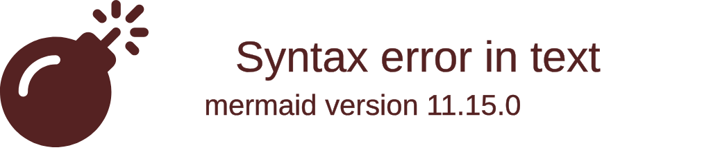

# Lab 01: HTTP Traffic Analysis and IP Exploration with Wireshark and Shodan

**Objective:** Analyze HTTP traffic and explore IP addresses to identify services, organizations, and potential security risks.

## 🧰 Environment and Tools
- 💻 Kali Linux on Oracle VirtualBox  
- 🌐 Monitored interface: `eth0`  
- 🛠 Wireshark, Shodan, WHOIS / NSLookup / Dig  

---

## 🔎 Visual Procedure

```
flowchart TD
    Browser[Navegator 🌐] -->|GET / HTTP| Server[Web Server / Destination IP 🖥️]
    Server -->|HTTP Response| Browser
    Server --> Capture[Wireshark Capture 📦]
    Capture --> Filter[http.request Filter 🔍]
    Filter --> Identify[IP Identification 🧩]
    Identify --> Shodan[Shodan Investigation 🛰️]
    Shodan --> Insights[Findings and Analysis 📊]
```

## 📊 Findings by IP (Dashboard)

| IP | Domain / Host | Organization | Location | Traffic Type | Observations |
|----|---------------|--------------|----------|--------------|--------------|
| 89.46.106.15 | – | – | – | 🟢 Legitimate | Access to images `/wp-content/uploads/`. Possible WordPress |
| 216.58.205.35 | 1e100.net | Google LLC | Milan, Italy | 🟢 Legitimate | Google services (Search, Ads, Analytics). Embedded scripts |
| 3.165.245.25 | amazontrust.com | Amazon Trust Services | – | 🔵 Infrastructure | SSL/TLS validation (OCSP/CRL) |
| 158.102.161.78 | comune.torino.it / regione.piemonte.it | CSI Piemonte | Turin, Italy | 🟡 Institutional | Virtual hosting, multi‑domain certificate (>70 SANs) |
| 34.107.221.82 | detectportal.firefox.com | Google Cloud | Kansas City, USA | 🟢 Legitimate | Firefox captive‑portal check (`success.txt`) |

🟢 **Legitimate** — 🟡 **Institutional** — 🔵 **Automated Infrastructure**

## 🛠 Network Intelligence in Action

### **Step 1: Traffic Capture**
Captured HTTP traffic using Wireshark on interface `eth0`.


---

### **Step 2: Traffic Analysis**
Filtered HTTP requests using:
`http.request`



---

### **Step 3: Further Capture Inspection**
Observed recurring GET requests and content loading behavior.


---

### **Step 4: Shodan Investigation – Amazon IP**
IP `3.165.245.25` → Amazon Trust Services (OCSP/CRL)


---

### **Step 5: Shodan Investigation – Comune IP**
IP `158.102.161.78` → CSI Piemonte (multi‑domain hosting)


## 📈 Charts



3️⃣ Tools Used
🛠 Tools and Techniques

Wireshark → HTTP traffic capture and filtering

Shodan → IP and service investigation

VirusTotal (optional) → file/domain analysis

WHOIS / NSLookup / Dig → DNS and domain lookup

💡 Key Findings

Traffic is mostly legitimate or browser‑related.

Institutional traffic originates from CSI Piemonte.

Automated traffic from Amazon Trust Services corresponds to SSL certificate validation.

No malicious behavior detected.

⚠️ Ethical Note

All work was performed in a controlled lab environment for ethical cybersecurity training.
Unauthorized traffic interception or reconnaissance is illegal and unethical.
Always respect privacy and act with integrity.

