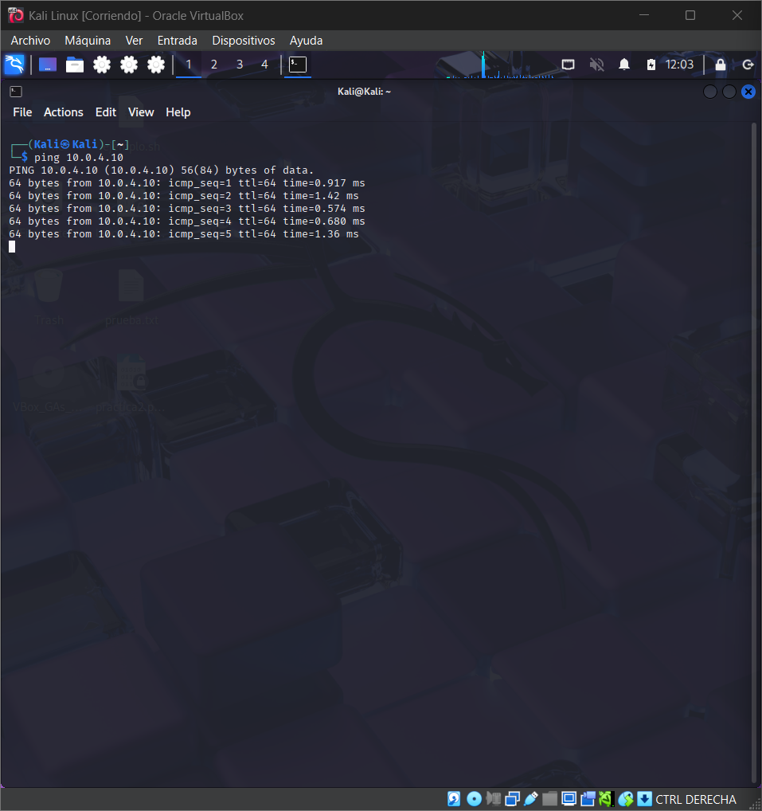

### SYN Scan Simulation and TCP Traffic Detection

### Exercise Objective

Simulate a TCP SYN port scan from a Kali Linux VM to a Xubuntu VM within a VirtualBox internal network. Capture and analyze the traffic in real time using `tcpdump`, in order to:

- Understand how SYN scans appear on the network.
    
- Identify how they can be detected from a defensive perspective.
    
- Practice documenting such activity in a SOC-style report.
    

---

###  Environment Used

- **Kali Linux VM** → IP `10.0.4.20`
    
- **Xubuntu VM** → IP `10.0.4.10`
    
- **VirtualBox Internal Network** → `10.0.4.0/24`
    
- **Tools** → `nmap`, `tcpdump`, `ip`, `ping`
    

---

### Detailed Steps

#### 🔹 Step 1: Connectivity Check

**Commands:**

`ping 10.0.4.10  # From Kali ping 10.0.4.20  # From Xubuntu`

**Purpose:** verify that both VMs can communicate within the subnet.

